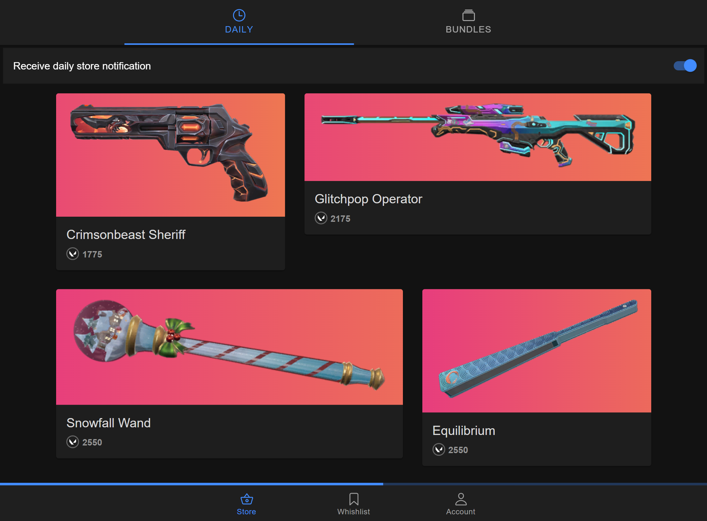

<p align="center">
  <a href="https://github.com/Soneliem/vALDI">
    
  </a>
</p>
<h3 align="center">vALDI - a Valorant store checker</h3>
<h1 align="center"><a href="https://valdi.sonel.dev">valdi.sonel.dev </a></h1>

  <p align="center">
    A cross-platform web and mobile app to view your valorant store</p>
    <p align="center">
    <a href="https://discord.gg/X7CYCeZSRK">
      
    </a>
    
    
    
    
  <br />



## About The Project

A simple cross-platform web and mobile app to view your Valorant store. Created by Soneliem.

Name derived from my favourite grocery store that overworks and understaffs its workers.

### Download

|Android|Android (APK)|Web|
|:-----:|:-----------:|:---:|
|<a href="https://play.google.com/store/apps/details?id=dev.sonel.valdi&pcampaignid=pcampaignidMKT-Other-global-all-co-prtnr-py-PartBadge-Mar2515-1"></a>|<a href="https://github.com/Soneliem/vALDI/releases"></a>|<a href="https://valdi.sonel.dev"></a>|

### Current Features

<div class="table2"></div>

|View Store|Fun Reveal Mechanic*|Wishlist|
|:---:|:---:|:---:|
||||

<div class="table3"></div>

|Daily Store Notifications|View Bundles|Mobile App|
|:---:|:---:|:---:|
||||

#### Other features

- [x] MFA Support
- [x] Published to Play Store

#### Planned Features

- [ ] Night Market
- [ ] Multi Account Support

*Fun is subjective

## FAQ

### Are my credentials stored on servers?

By default your access tokens (NOT username and password) are stored on your own device's browser. If the wishlist feature or daily notifications are enabled, your access tokens are stored on the server. This is to allow for the wishlist feature and daily notifications to work. You can disable these features at any time to remove your access tokens from the server.

## Tech Stack

**Client:** Ionic + Vite + Vue + Typescript >
Deployed on web with [Vercel](https://vercel.com)

**Server:** NodeJS + Express 5 > Deployed on [Qoddi](https://qoddi.com/)

Thank you to [Qoddi](https://qoddi.com/) for providing free hosting this project

## Why?

Making a store checker is a rite of passage for any Valorant App Dev. I am simply following the tradition. I also wanted to learn more about Ionic and the Android app deployment, so this was a good opportunity to do so. Is there are any questionable design decisions in my code of stack, this is why, I am simply experimenting.

## Run Locally

Clone the project

```bash
  git clone https://github.com/Soneliem/vALDI.git
```

Install dependencies

```bash
  yarn
```

This repo is a Yarn workspace (monorepo), so you can also run the server and client separately if you need to

```bash
  yarn run backend
  yarn run frontend
```

## Contributing

Contributions are always welcome! Please use the `development` branch for PRs

## Contact

**Official Website:** [valdi.sonel.dev](https://valdi.sonel.dev)  
**Discord:** Soneliem#4194  
**Project Link:** [https://github.com/Soneliem/vALDI](https://github.com/Soneliem/vALDI)  
**Discord Server:**  
[](https://discord.gg/X7CYCeZSRK)  

## Acknowledgements

- [valorant.ts](https://github.com/KTNG-3/valorant-api) for the API wrapper
- [Valorant-API](https://valorant-api.com/) for the static assets API

## DISCLAIMER

THIS PROJECT IS NOT ASSOCIATED OR ENDORSED BY RIOT GAMES. Riot Games, and all associated properties are trademarks or registered trademarks of Riot Games, Inc.
By using this application, you agree that you, the individual, are knowingly accessing all information required to be displayed.

Google Play and the Google Play logo are trademarks of Google LLC.

## Privacy Policy

Privacy Policy available [here](https://valdi.sonel.dev/privacy)
