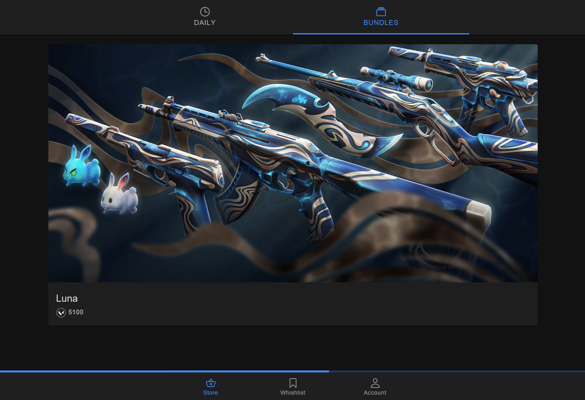

<p align="center">
  <a href="https://github.com/Soneliem/WAIUA">
    
  </a>
</p>
<h3 align="center">vALDI</h3>
<h4 align="center">Valorant Store Checker</h4>
<a href="https://valdi.sonel.dev"><h1 align="center">valdi.sonel.dev</h1></a>

  <p align="center">
    A cross-platform web and mobile app to view your valorant store</p>
    <p align="center">
    <a href="https://discord.gg/X7CYCeZSRK">
      
    </a>
    
    
  <br />


## About The Project

A simple cross-platform web and mobile app to view your Valorant store. Created by Soneliem.

Name derived after my favourite grocery store that overworks and understaffs its workers.

### Current Features

|View Store|View Bundle|Fun* Reveal Mechanic|Mobile App|
|:---:|:---:|:---:|:---:|
|||||

*Fun is subjective

## FAQ

### Are my credentials stored on servers?

No, but your access tokens are stored on your own device's browser

## Tech Stack

**Client:** Ionic + Vite + Vue + Typescript >
Deployed on web with [Vercel](https://vercel.com)

**Server:** NodeJS + Express > Deployed on [Qoddi](https://qoddi.com/)

Thank you to [Qoddi](https://qoddi.com/) for providing free hosting this project

## License

[MIT](https://choosealicense.com/licenses/mit/)

## Run Locally

Clone the project

```bash
  git clone https://github.com/Soneliem/vALDI.git
```

Install dependencies

```bash
  yarn
```

Start the app

```bash
  yarn run start
```

This repo is a Yarn workspace (monorepo), so you can also run the server and client separately if you need to

```bash
  yarn run backend
  yarn run frontend
```

## Contributing

Contributions are always welcome! Please use the `development` branch for PRs

## Contact

**Official Website:** [valdi.sonel.dev](https://valdi.sonel.dev)  
**Discord:** Soneliem#4194  
**Project Link:** [https://github.com/Soneliem/vALDI](https://github.com/Soneliem/vALDI)  
**Discord Server:**  
[](https://discord.gg/X7CYCeZSRK)  

## Acknowledgements

- [valorant.ts](https://github.com/KTNG-3/valorant-api) for the API wrapper

## DISCLAIMER

THIS PROJECT IS NOT ASSOCIATED OR ENDORSED BY RIOT GAMES. Riot Games, and all associated properties are trademarks or registered trademarks of Riot Games, Inc.
By using this application, you agree that you, the individual, are knowingly accessing all information required to be displayed.
